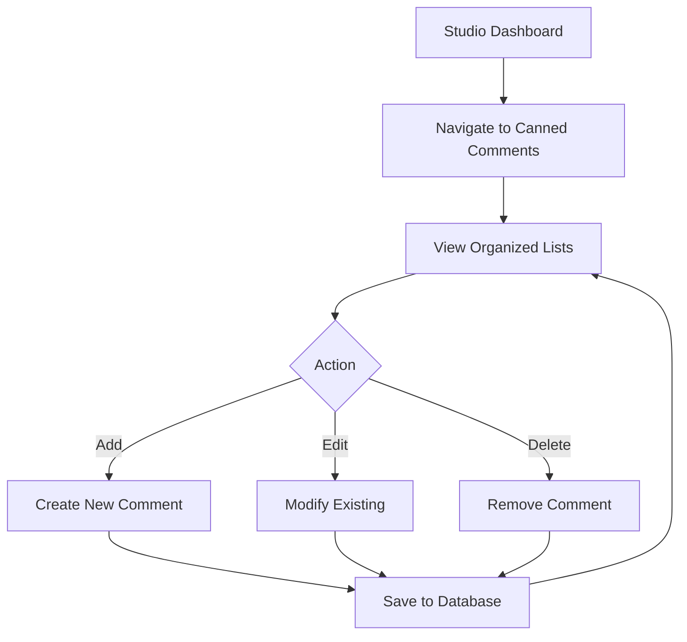
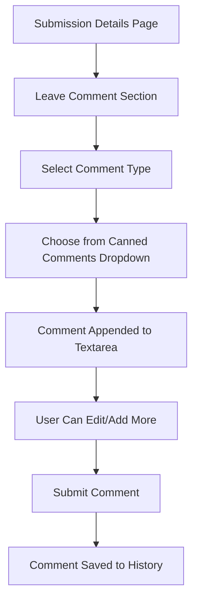

# Technical Specification: Canned Staff Comments Feature

## Overview

This feature will allow staff members to create, manage, and reuse predefined comment templates when adding comments to questionnaire submissions. The canned comments will be scoped per creator (studio owner) and support both internal notes and public comments.

## 1. Database Schema Design

### 1.1 New Entity: `CannedCommentEntity`

```csharp
// Location: Namezr/Features/Questionnaires/Data/CannedCommentEntity.cs
public class CannedCommentEntity
{
    public Guid Id { get; set; }
    
    public CreatorEntity Creator { get; set; } = null!;
    public Guid CreatorId { get; set; }
    
    [MaxLength(TitleMaxLength)]
    public required string Title { get; set; }
    
    [MaxLength(ContentMaxLength)]
    public required string Content { get; set; }
    
    public required CannedCommentType Type { get; set; }
    
    public required Instant CreatedAt { get; set; }
    public required Instant UpdatedAt { get; set; }
    
    // Optional: Order for display purposes
    public int DisplayOrder { get; set; }
    
    public const int TitleMaxLength = 100;
    public const int ContentMaxLength = SubmissionHistoryEntryEntity.CommentContentMaxLength; // 5000
}

public enum CannedCommentType
{
    InternalNote = 0,
    PublicComment = 1,
    Both = 2 // Can be used for either type
}
```

### 1.2 Database Configuration

```csharp
// Location: Namezr/Features/Questionnaires/Data/CannedCommentEntityConfiguration.cs
internal class CannedCommentEntityConfiguration : IEntityTypeConfiguration<CannedCommentEntity>
{
    public void Configure(EntityTypeBuilder<CannedCommentEntity> builder)
    {
        builder.HasKey(x => x.Id);
        
        builder.HasOne(x => x.Creator)
            .WithMany()
            .HasForeignKey(x => x.CreatorId)
            .OnDelete(DeleteBehavior.Cascade);
            
        builder.HasIndex(x => new { x.CreatorId, x.Type })
            .HasDatabaseName("IX_CannedComments_CreatorId_Type");
            
        builder.Property(x => x.Title)
            .HasMaxLength(CannedCommentEntity.TitleMaxLength);
            
        builder.Property(x => x.Content)
            .HasMaxLength(CannedCommentEntity.ContentMaxLength);
    }
}
```

### 1.3 DbContext Updates

```csharp
// Location: Namezr/Features/Questionnaires/Data/ApplicationDbContext.Questionnaires.cs
public DbSet<CannedCommentEntity> CannedComments { get; set; } = null!;

// In ConfigureQuestionnaires method:
CannedCommentEntityConfiguration.Apply(modelBuilder);
```

## 2. API Endpoints Specification

### 2.1 Get Canned Comments Endpoint

```csharp
// Location: Namezr/Features/Questionnaires/Endpoints/GetCannedCommentsEndpoint.cs
[RegisterScoped]
public class GetCannedCommentsEndpoint : IRoute
{
    public static void Map(IEndpointRouteBuilder app) =>
        app.MapGet("/api/creators/{creatorId}/canned-comments", Handle)
           .RequireAuthorization()
           .WithName("GetCannedComments");

    public static async Task<IResult> Handle(
        Guid creatorId,
        CannedCommentType? type,
        IDbContextFactory<ApplicationDbContext> dbContextFactory,
        HttpContext httpContext,
        IStudioAccessService studioAccessService)
    {
        await studioAccessService.ValidateStudioAccess(creatorId, httpContext.User);
        
        await using ApplicationDbContext dbContext = await dbContextFactory.CreateDbContextAsync();
        
        IQueryable<CannedCommentEntity> query = dbContext.CannedComments
            .Where(x => x.CreatorId == creatorId);
            
        if (type.HasValue)
        {
            query = query.Where(x => x.Type == type.Value || x.Type == CannedCommentType.Both);
        }
        
        List<CannedCommentModel> comments = await query
            .OrderBy(x => x.DisplayOrder)
            .ThenBy(x => x.Title)
            .Select(x => new CannedCommentModel
            {
                Id = x.Id,
                Title = x.Title,
                Content = x.Content,
                Type = x.Type
            })
            .ToListAsync();
            
        return Results.Ok(comments);
    }
}
```

### 2.2 Create Canned Comment Endpoint

```csharp
// Location: Namezr/Features/Questionnaires/Endpoints/CreateCannedCommentEndpoint.cs
[RegisterScoped]
public class CreateCannedCommentEndpoint : IRoute
{
    public static void Map(IEndpointRouteBuilder app) =>
        app.MapPost("/api/creators/{creatorId}/canned-comments", Handle)
           .RequireAuthorization()
           .WithName("CreateCannedComment");

    public static async Task<IResult> Handle(
        Guid creatorId,
        CreateCannedCommentRequest request,
        IDbContextFactory<ApplicationDbContext> dbContextFactory,
        HttpContext httpContext,
        IStudioAccessService studioAccessService,
        IClock clock)
    {
        await studioAccessService.ValidateStudioAccess(creatorId, httpContext.User);
        
        await using ApplicationDbContext dbContext = await dbContextFactory.CreateDbContextAsync();
        
        CannedCommentEntity entity = new()
        {
            Id = Guid.NewGuid(),
            CreatorId = creatorId,
            Title = request.Title,
            Content = request.Content,
            Type = request.Type,
            CreatedAt = clock.GetCurrentInstant(),
            UpdatedAt = clock.GetCurrentInstant(),
            DisplayOrder = await GetNextDisplayOrder(dbContext, creatorId)
        };
        
        dbContext.CannedComments.Add(entity);
        await dbContext.SaveChangesAsync();
        
        return Results.Created($"/api/creators/{creatorId}/canned-comments/{entity.Id}", 
            new CannedCommentModel
            {
                Id = entity.Id,
                Title = entity.Title,
                Content = entity.Content,
                Type = entity.Type
            });
    }
    
    private static async Task<int> GetNextDisplayOrder(ApplicationDbContext dbContext, Guid creatorId)
    {
        int? maxOrder = await dbContext.CannedComments
            .Where(x => x.CreatorId == creatorId)
            .MaxAsync(x => (int?)x.DisplayOrder);
            
        return (maxOrder ?? 0) + 1;
    }
}
```

### 2.3 Update/Delete Endpoints

```csharp
// Location: Namezr/Features/Questionnaires/Endpoints/UpdateCannedCommentEndpoint.cs
// Location: Namezr/Features/Questionnaires/Endpoints/DeleteCannedCommentEndpoint.cs
// Similar patterns following the existing endpoint conventions
```

## 3. Models and DTOs

### 3.1 Request/Response Models

```csharp
// Location: Namezr/Features/Questionnaires/Models/CannedCommentModels.cs
public class CannedCommentModel
{
    public Guid Id { get; set; }
    public required string Title { get; set; }
    public required string Content { get; set; }
    public required CannedCommentType Type { get; set; }
}

public class CreateCannedCommentRequest
{
    public required string Title { get; set; }
    public required string Content { get; set; }
    public required CannedCommentType Type { get; set; }
}

public class UpdateCannedCommentRequest
{
    public required string Title { get; set; }
    public required string Content { get; set; }
    public required CannedCommentType Type { get; set; }
}

// Validation
[RegisterSingleton(typeof(IValidator<CreateCannedCommentRequest>))]
public class CreateCannedCommentRequestValidator : AbstractValidator<CreateCannedCommentRequest>
{
    public CreateCannedCommentRequestValidator()
    {
        RuleFor(x => x.Title)
            .NotEmpty()
            .MaximumLength(CannedCommentEntity.TitleMaxLength);
            
        RuleFor(x => x.Content)
            .NotEmpty()
            .MaximumLength(CannedCommentEntity.ContentMaxLength);
            
        RuleFor(x => x.Type)
            .IsInEnum();
    }
}
```

## 4. Component Architecture

### 4.1 Studio Configuration Page

```razor
@* Location: Namezr/Features/Questionnaires/Pages/StudioCannedCommentsManagement.razor *@
@page "/studio/{creatorId:guid}/questionnaires/canned-comments"
@layout StudioPageHeaderLayout

<SectionContent SectionId="StudioPageHeaderLayout.TitleSectionId">
    Canned Comments
</SectionContent>

<SectionContent SectionId="StudioPageHeaderLayout.ButtonsSectionId">
    <HxButton Color="ThemeColor.Primary" OnClick="ShowCreateModal">
        <HxIcon Icon="BootstrapIcon.Plus" />
        Add Comment
    </HxButton>
</SectionContent>

<div class="d-flex flex-column gap-3">
    <HxCard>
        <HeaderTemplate>
            Internal Notes
        </HeaderTemplate>
        <BodyTemplate>
            <CannedCommentsTable 
                Comments="_internalComments" 
                OnEdit="HandleEdit" 
                OnDelete="HandleDelete" 
            />
        </BodyTemplate>
    </HxCard>

    <HxCard>
        <HeaderTemplate>
            Public Comments
        </HeaderTemplate>
        <BodyTemplate>
            <CannedCommentsTable 
                Comments="_publicComments" 
                OnEdit="HandleEdit" 
                OnDelete="HandleDelete" 
            />
        </BodyTemplate>
    </HxCard>
</div>

<HxModal @ref="_createEditModal" Title="@_modalTitle">
    <BodyTemplate>
        <EditForm Model="CurrentComment" OnValidSubmit="HandleSave">
            <FluentValidationValidator />
            
            <HxInputText Label="Title" @bind-Value="CurrentComment.Title" />
            <HxInputTextArea Label="Content" @bind-Value="CurrentComment.Content" Rows="4" />
            <HxSelect 
                Label="Type" 
                TItem="CannedCommentType" 
                TValue="CannedCommentType"
                @bind-Value="CurrentComment.Type"
                Data="Enum.GetValues<CannedCommentType>()"
                TextSelector="@(type => type.Humanize())"
                Nullable="false"
            />
            
            <div class="d-flex gap-2">
                <HxSubmit Color="ThemeColor.Primary" Text="Save" />
                <HxButton Color="ThemeColor.Secondary" OnClick="CloseModal">Cancel</HxButton>
            </div>
        </EditForm>
    </BodyTemplate>
</HxModal>
```

### 4.2 Canned Comments Table Component

```razor
@* Location: Namezr/Features/Questionnaires/Components/CannedCommentsTable.razor *@
@if (Comments.Any())
{
    <table class="table table-striped">
        <thead>
            <tr>
                <th>Title</th>
                <th>Content</th>
                <th style="width: 1%; white-space: nowrap;">Actions</th>
            </tr>
        </thead>
        <tbody>
            @foreach (var comment in Comments)
            {
                <tr>
                    <td>@comment.Title</td>
                    <td>
                        <StaticTruncatedText Text="@comment.Content" MaxLength="100" />
                    </td>
                    <td>
                        <div class="d-flex gap-1">
                            <HxButton Size="ButtonSize.Small" Color="ThemeColor.Secondary" 
                                     OnClick="() => OnEdit.InvokeAsync(comment)">
                                <HxIcon Icon="BootstrapIcon.PencilSquare" />
                            </HxButton>
                            <HxButton Size="ButtonSize.Small" Color="ThemeColor.Danger" 
                                     OnClick="() => OnDelete.InvokeAsync(comment)">
                                <HxIcon Icon="BootstrapIcon.Trash" />
                            </HxButton>
                        </div>
                    </td>
                </tr>
            }
        </tbody>
    </table>
}
else
{
    <div class="text-muted text-center py-3">
        No canned comments configured yet.
    </div>
}
```

### 4.3 Enhanced Comment Form Component

```razor
@* Location: Namezr/Features/Questionnaires/Components/SubmissionCommentForm.razor *@
<EditForm Model="CommentModel" FormName="@FormName" OnValidSubmit="OnValidSubmit">
    <FluentValidationValidator/>

    <HxSelect
        TItem="StudioSubmissionCommentType"
        TValue="StudioSubmissionCommentType"
        Label="Type"
        Nullable="false"
        Data="Enum.GetValues<StudioSubmissionCommentType>()"
        @bind-Value="@CommentModel!.Type"
        TextSelector="@(type => type.Humanize())"
    />

    @if (_cannedComments.Any())
    {
        <div class="mb-3">
            <label class="form-label">Quick Insert</label>
            <HxSelect
                TItem="CannedCommentModel"
                TValue="CannedCommentModel?"
                Data="_cannedComments"
                @bind-Value="_selectedCannedComment"
                TextSelector="@(c => c?.Title ?? "Select a canned comment...")"
                Nullable="true"
                OnValueChanged="HandleCannedCommentSelected"
            />
        </div>
    }

    <HxInputTextArea @bind-Value="CommentModel.Content" @ref="_contentTextArea" />

    <HxSubmit Color="ThemeColor.Primary" Text="Submit"/>
</EditForm>

@code {
    [Parameter] public StudioSubmissionCommentModel CommentModel { get; set; } = null!;
    [Parameter] public string FormName { get; set; } = null!;
    [Parameter] public EventCallback OnValidSubmit { get; set; }
    [Parameter] public Guid CreatorId { get; set; }

    private List<CannedCommentModel> _cannedComments = [];
    private CannedCommentModel? _selectedCannedComment;
    private HxInputTextArea _contentTextArea = null!;

    protected override async Task OnInitializedAsync()
    {
        await LoadCannedComments();
    }

    private async Task LoadCannedComments()
    {
        // Call API to load canned comments filtered by type
        CannedCommentType filterType = CommentModel.Type switch
        {
            StudioSubmissionCommentType.InternalNote => CannedCommentType.InternalNote,
            StudioSubmissionCommentType.PublicComment => CannedCommentType.PublicComment,
            _ => CannedCommentType.Both
        };
        
        // Implementation to call GetCannedCommentsEndpoint
    }

    private async Task HandleCannedCommentSelected(CannedCommentModel? selectedComment)
    {
        if (selectedComment != null)
        {
            string separator = string.IsNullOrEmpty(CommentModel.Content) ? "" : "\n\n";
            CommentModel.Content += separator + selectedComment.Content;
            _selectedCannedComment = null; // Reset selection
            StateHasChanged();
        }
    }
}
```

## 5. User Experience Flow

### 5.1 Management Flow


### 5.2 Usage Flow


## 6. Implementation Phases

### Phase 1: Core Infrastructure
- [ ] Create `CannedCommentEntity` and configuration
- [ ] Add database migration
- [ ] Create basic CRUD endpoints
- [ ] Create data models and validators

### Phase 2: Management Interface
- [ ] Build Studio configuration page
- [ ] Create `CannedCommentsTable` component
- [ ] Implement create/edit modal
- [ ] Add navigation links

### Phase 3: Integration
- [ ] Create enhanced comment form component
- [ ] Integrate canned comments dropdown
- [ ] Update `StudioSubmissionDetails.razor`
- [ ] Add API calls and state management

### Phase 4: Polish & Testing
- [ ] Add loading states and error handling
- [ ] Implement soft deletion if needed
- [ ] Add sorting/reordering functionality
- [ ] Comprehensive testing

## 7. Technical Considerations

### 7.1 Security
- Canned comments are scoped to creator - users can only access their own
- Existing studio access validation applies
- Comment content still subject to same validation rules

### 7.2 Performance
- Comments loaded on-demand when comment form is displayed
- Simple caching could be added if needed
- Minimal database impact due to creator scoping

### 7.3 Extensibility
- Design allows for future categorization if needed
- Easy to add metadata fields (description, usage count, etc.)
- Template system could be added later for placeholders

## 8. Integration Points

### 8.1 Existing System Integration
- Integrates with existing [`SubmissionHistoryEntryEntity`](Namezr/Features/Questionnaires/Data/SubmissionHistoryEntryEntity.cs:10) inheritance hierarchy
- Uses existing [`StudioSubmissionCommentModel`](Namezr/Features/Questionnaires/Pages/StudioSubmissionCommentModel.cs:6) and validation
- Follows existing [`StudioPageHeaderLayout`](Namezr/Components/Layout/StudioPageHeaderLayout.razor:4) pattern
- Leverages existing creator access validation patterns

### 8.2 Modified Files
- [`StudioSubmissionDetails.razor`](Namezr/Features/Questionnaires/Pages/StudioSubmissionDetails.razor:296) - Replace comment form with enhanced component
- Navigation/menu structure - Add link to canned comments management
- Studio dashboard - Optional quick access to canned comments

This architecture follows the existing project patterns and provides a solid foundation for the canned staff comments feature while maintaining consistency with the current codebase structure.