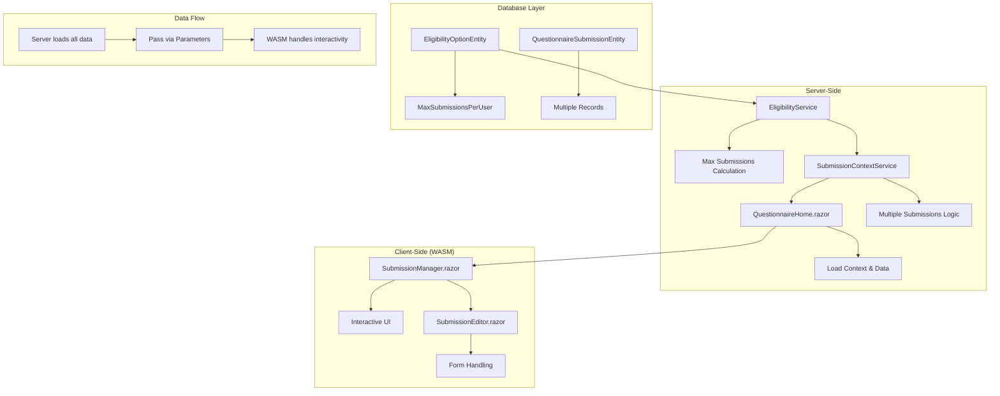

# Multiple Submissions per Questionnaire - Implementation Plan

## 🎯 **Feature Requirements Summary**
- **Submission Limit**: Configurable limit (1-10 submissions per user)
- **User Experience**: Users can edit any of their existing submissions
- **Default Behavior**: Existing questionnaires remain single-submission by default
- **Location**: Configuration in Creator Studio eligibility options (per eligibility option)

## 🗂️ **Current System Analysis**

**Key Findings:**
1. **Single Submission Enforcement**: Line 132-135 in [`QuestionnaireSubmissionContextService.cs`](Namezr/Features/Questionnaires/Services/QuestionnaireSubmissionContextService.cs:132) enforces one submission per user per questionnaire
2. **Distributed Locking**: Lines 58-62 in [`SubmissionSaveEndpoint.cs`](Namezr/Features/Questionnaires/Endpoints/SubmissionSaveEndpoint.cs:58) use distributed locks with naming pattern based on questionnaire and user ID
3. **Server-Side vs Client-Side Architecture**: [`QuestionnaireHome.razor`](Namezr/Features/Questionnaires/Pages/QuestionnaireHome.razor:1) is a server-side component (no `@rendermode` directive) and can pass data directly to WASM components via parameters
4. **Eligibility System**: [`EligibilityService.cs`](Namezr/Features/Eligibility/Services/EligibilityService.cs:67) `ClassifyEligibility` method is the central place for eligibility calculations
5. **Existing WASM Components**: [`SubmissionEditor.razor`](Namezr.Client/Public/Questionnaires/SubmissionEditor.razor:6) is already a WASM component with `@rendermode InteractiveWebAssembly`

## 📋 **Implementation Plan**

### **Phase 1: Database Schema Changes**

#### **1.1 Add MaxSubmissionsPerUser Field to EligibilityOptionEntity**
Add to [`EligibilityOptionEntity.cs`](Namezr/Features/Eligibility/Data/EligibilityOptionEntity.cs:10):

```csharp
[EntityTypeConfiguration(typeof(EligibilityOptionEntityConfiguration))]
public class EligibilityOptionEntity
{
    public long Id { get; set; }

    public EligibilityConfigurationEntity Configuration { get; set; } = null!;
    public long ConfigurationId { get; set; }

    public required EligibilityPlanId PlanId { get; set; }

    public required int Order { get; set; }

    [MaxLength(EligibilityOptionEditModel.PriorityGroupMaxLength)]
    public required string PriorityGroup { get; set; }

    public required decimal PriorityModifier { get; set; }
    
    public int MaxSubmissionsPerUser { get; set; } = 1; // NEW FIELD
    
    // TODO: add SelectionWave, e.g. all "1"s must be selected before "2"s are considered
}
```

#### **1.2 Create Database Migration**
```csharp
public partial class AddMaxSubmissionsPerUserToEligibilityOption : Migration
{
    protected override void Up(MigrationBuilder migrationBuilder)
    {
        migrationBuilder.AddColumn<int>(
            name: "MaxSubmissionsPerUser",
            table: "EligibilityOptions",
            type: "integer",
            nullable: false,
            defaultValue: 1);
    }

    protected override void Down(MigrationBuilder migrationBuilder)
    {
        migrationBuilder.DropColumn(
            name: "MaxSubmissionsPerUser",
            table: "EligibilityOptions");
    }
}
```

### **Phase 2: Business Logic Updates**

#### **2.1 Update EligibilityResult Model**
Add to [`EligibilityResult`](Namezr.Client/Types/EligibilityResultModel.cs) to include submission limit:

```csharp
public class EligibilityResult
{
    public ImmutableHashSet<EligibilityPlanId> EligiblePlanIds { get; set; } = ImmutableHashSet<EligibilityPlanId>.Empty;
    public decimal Modifier { get; set; }
    public int MaxSubmissionsPerUser { get; set; } = 1; // NEW FIELD
    
    public bool Any => EligiblePlanIds.Count > 0;
}
```

#### **2.2 Update EligibilityService to Calculate Max Submissions**
Modify [`EligibilityService.cs`](Namezr/Features/Eligibility/Services/EligibilityService.cs:67) `ClassifyEligibility` method:

```csharp
public async Task<EligibilityResult> ClassifyEligibility(
    Guid userId, EligibilityConfigurationEntity configuration,
    UserStatusSyncEagerness syncEagerness
)
{
    using Activity? activity = Diagnostics.ActivitySource.StartActivity();
    activity?.SetTag("UserId", userId);
    activity?.SetTag("EligibilityConfigurationId", configuration.Id);

    Guard.IsTrue(configuration.Options?.Count > 0);

    // ... existing logic for support plan matching ...

    if (isMatchingPerEligibilityPlan.Values.All(x => !x))
    {
        return new EligibilityResult
        {
            EligiblePlanIds = ImmutableHashSet<EligibilityPlanId>.Empty,
            MaxSubmissionsPerUser = 0, // Not eligible for any submissions
        };
    }

    // ... existing priority group logic ...

    // NEW: Calculate max submissions from eligible options
    int maxSubmissions = configuration.Options
        .Where(option => isMatchingPerEligibilityPlan[option.PlanId])
        .Select(option => option.MaxSubmissionsPerUser)
        .Prepend(1) // Default to 1 if no eligible options (safety)
        .Max();

    EligibilityResult result = new()
    {
        EligiblePlanIds = isMatchingPerEligibilityPlan
            .Where(x => x.Value)
            .Select(x => x.Key)
            .ToImmutableHashSet(),

        Modifier = modifier,
        MaxSubmissionsPerUser = maxSubmissions, // NEW
    };

    // ... existing caching logic ...

    return result;
}
```

#### **2.3 Add New Submission Disabled Reason**
```csharp
// Add to existing enum in Models
public enum SubmissionDisabledReason
{
    NotLoggedIn,
    NotEligible,
    SubmissionsClosed,
    AlreadyApproved,
    SubmissionLimitReached // NEW
}
```

#### **2.4 Update Submission Context Model**
Update [`QuestionnaireSubmissionContext`](Namezr/Features/Questionnaires/Models) to support multiple submissions:

```csharp
public class QuestionnaireSubmissionContext
{
    public QuestionnaireVersionEntity QuestionnaireVersion { get; set; } = null!;
    public ApplicationUser? CurrentUser { get; set; }
    public List<QuestionnaireSubmissionEntity> ExistingSubmissions { get; set; } = []; // Changed from single to list
    public EligibilityResult? EligibilityResult { get; set; }
    public SubmissionDisabledReason? DisabledReason { get; set; }
    public bool CanCreateNewSubmission { get; set; } = true; // NEW
    
    // Convenience property that gets value from EligibilityResult
    public int MaxSubmissionsAllowed => EligibilityResult?.MaxSubmissionsPerUser ?? 1;
}
```

#### **2.5 Update Submission Context Service**
Simplify [`QuestionnaireSubmissionContextService.cs`](Namezr/Features/Questionnaires/Services/QuestionnaireSubmissionContextService.cs:96) since eligibility calculation now includes max submissions:

```csharp
public async Task<QuestionnaireSubmissionContext> GetSubmissionContextAsync(QuestionnaireVersionEntity questionnaireVersion, ApplicationUser? currentUser, CancellationToken ct)
{
    if (questionnaireVersion is null)
    {
        throw new Exception($"QuestionnaireVersion cannot be null.");
    }

    SubmissionDisabledReason? disabledReason = null;
    if (questionnaireVersion.Questionnaire.SubmissionOpenMode == QuestionnaireSubmissionOpenMode.Closed)
    {
        disabledReason = SubmissionDisabledReason.SubmissionsClosed;
    }

    EligibilityResult? eligibilityResult = null;
    List<QuestionnaireSubmissionEntity> existingSubmissions = [];
    bool canCreateNew = true;

    if (currentUser is null)
    {
        disabledReason ??= SubmissionDisabledReason.NotLoggedIn;
        canCreateNew = false;
    }
    else
    {
        // Get eligibility result with max submissions already calculated
        eligibilityResult = await _eligibilityService.ClassifyEligibility(
            currentUser.Id,
            questionnaireVersion.Questionnaire.EligibilityConfiguration,
            UserStatusSyncEagerness.Default
        );

        if (!eligibilityResult.Any)
        {
            disabledReason ??= SubmissionDisabledReason.NotEligible;
            canCreateNew = false;
        }

        // Load ALL user submissions for this questionnaire (changed from FirstOrDefaultAsync)
        existingSubmissions = await _dbContext.QuestionnaireSubmissions
            .AsSplitQuery()
            .Include(x => x.FieldValues)
            .Where(x => x.UserId == currentUser.Id && x.Version.QuestionnaireId == questionnaireVersion.Questionnaire.Id)
            .OrderByDescending(x => x.SubmittedAt)
            .ToListAsync(ct);

        // Check submission limits using the calculated max from eligibility
        if (existingSubmissions.Count >= eligibilityResult.MaxSubmissionsPerUser)
        {
            canCreateNew = false;
            if (questionnaireVersion.Questionnaire.SubmissionOpenMode == QuestionnaireSubmissionOpenMode.EditExistingOnly)
            {
                // User can edit existing submissions but not create new ones
            }
            else if (existingSubmissions.Count > 0)
            {
                // User has reached limit and cannot create new submissions
                disabledReason ??= SubmissionDisabledReason.SubmissionLimitReached;
            }
        }
    }

    return new QuestionnaireSubmissionContext
    {
        QuestionnaireVersion = questionnaireVersion,
        CurrentUser = currentUser,
        ExistingSubmissions = existingSubmissions,
        EligibilityResult = eligibilityResult,
        DisabledReason = disabledReason,
        CanCreateNewSubmission = canCreateNew && disabledReason == null,
    };
}
```

#### **2.6 Update Submission Save Endpoint**
Modify [`SubmissionSaveEndpoint.cs`](Namezr/Features/Questionnaires/Endpoints/SubmissionSaveEndpoint.cs:30) to use the context's max submissions:

```csharp
// Keep existing distributed lock - prevents race conditions
await using var _ = await distributedLockProvider.AcquireLockAsync(
    GetLockName(questionnaireVersion.QuestionnaireId, currentUser!.Id),
    cancellationToken: ct
);

QuestionnaireSubmissionContext context = await contextService.GetSubmissionContextAsync(questionnaireVersion, currentUser, ct);
List<QuestionnaireSubmissionEntity> existingSubmissions = context.ExistingSubmissions;

// Handle submission selection for editing
QuestionnaireSubmissionEntity? submissionEntity = null;
if (model.SubmissionId.HasValue)
{
    // Editing existing submission
    submissionEntity = existingSubmissions.FirstOrDefault(x => x.Id == model.SubmissionId.Value);
    if (submissionEntity == null)
    {
        throw new ValidationException("Submission not found or not owned by user");
    }
}
else
{
    // Creating new submission - check limits using calculated max from eligibility
    if (existingSubmissions.Count >= context.MaxSubmissionsAllowed)
    {
        throw new ValidationException("Maximum number of submissions reached");
    }
}

// Rest of the existing logic remains the same...
```

#### **2.7 Update Submission Create Model**
Add to [`SubmissionCreateModel`](Namezr.Client/Public/Questionnaires/SubmissionCreateModel.cs):

```csharp
public class SubmissionCreateModel
{
    public Guid QuestionnaireVersionId { get; set; }
    public Guid? SubmissionId { get; set; } // NEW: For editing existing submissions
    public Dictionary<Guid, SubmissionValueModel> Values { get; set; } = new();
    public List<string> NewFileTickets { get; set; } = new();
}
```

### **Phase 3: Creator Studio UI Updates**

#### **3.1 Update Eligibility Option Edit Model**
Add to [`EligibilityOptionEditModel.cs`](Namezr.Client/Studio/Eligibility/Edit/EligibilityOptionEditModel.cs:6):

```csharp
public class EligibilityOptionEditModel
{
    public EligibilityPlanId? PlanId { get; set; }

    public string PriorityGroup { get; set; } = string.Empty;
    public decimal PriorityModifier { get; set; } = 1; // TODO: rename: Weight
    
    public int MaxSubmissionsPerUser { get; set; } = 1; // NEW FIELD

    [RegisterSingleton(typeof(IValidator<EligibilityOptionEditModel>))]
    internal sealed class Validator : AbstractValidator<EligibilityOptionEditModel>
    {
        public Validator()
        {
            RuleFor(x => x.PlanId)
                .NotNull();

            RuleFor(x => x.PriorityGroup)
                .MaximumLength(PriorityGroupMaxLength);

            RuleFor(x => x.PriorityModifier)
                .GreaterThan(0);

            // NEW VALIDATION
            RuleFor(x => x.MaxSubmissionsPerUser)
                .InclusiveBetween(1, 10)
                .WithMessage("Maximum submissions per user must be between 1 and 10");
        }
    }

    public const int PriorityGroupMaxLength = 50;
}
```

#### **3.2 Update Eligibility Option Editor**
Add to [`EligibilityOptionEditor.razor`](Namezr.Client/Studio/Eligibility/Edit/EligibilityOptionEditor.razor:6) - modify the column layout:

```razor
<div class="row">
    <div class="col-4"> <!-- Reduced from col-5 -->
        <HxSelect
            Data="EligibilityDescriptors"
            Nullable="false"
            Label="Support plan"
            @bind-Value="Value.PlanId"
            @bind-Value:after="AfterPlanChanged"
            ValueSelector="@(x => x.Id)"
            TextSelector="GetEligibilityDescriptorDisplayName"
        />
    </div>
    <div class="col-3"> <!-- Reduced from col-4 -->
        <HxInputText
            Label="Priority group"
            Placeholder="None"
            @bind-Value="Value.PriorityGroup"
        />
    </div>
    <div class="col-2">
        <HxTooltip
            Trigger="TooltipTrigger.Focus"
            Text="How likely the entry is to be selected. An entry with a weight of 6 is twice as likely as one with a weight of 3. Highest weight per priority group is used. When multiple priority groups match, the highest weights will be summed together."
        >
            <HxInputNumber
                Label="Weight"
                @bind-Value="Value.PriorityModifier"/>
        </HxTooltip>
    </div>
    <div class="col-2"> <!-- NEW COLUMN -->
        <HxTooltip
            Trigger="TooltipTrigger.Focus"
            Text="Maximum number of submissions each user can make with this eligibility option (1-10). Users get the highest limit from their eligible options."
        >
            <HxInputNumber
                Label="Max Submissions"
                @bind-Value="Value.MaxSubmissionsPerUser"
                Min="1"
                Max="10"/>
        </HxTooltip>
    </div>

    <div class="col-1">
        <HxButtonGroup>
            <HxButton
                Icon="@BootstrapIcon.Trash"
                Color="ThemeColor.Danger"
                Tooltip="Remove"
                Enabled="CanRemove"
                OnClick="OnRemove"
            />
        </HxButtonGroup>
    </div>
</div>
```

### **Phase 4: Client-Side Component Architecture**

#### **4.1 Create Data Transfer Models**
Create new file or add to existing: `Namezr.Client/Public/Questionnaires/SubmissionModels.cs`:

```csharp
using NodaTime;

namespace Namezr.Client.Public.Questionnaires;

public class QuestionnaireSubmissionSummaryModel
{
    public Guid Id { get; set; }
    public int Number { get; set; }
    public Instant SubmittedAt { get; set; }
    public Instant? ApprovedAt { get; set; }
}
```

#### **4.2 Create WASM Submission Management Component**
Create new file: `Namezr.Client/Public/Questionnaires/SubmissionManager.razor`:

```razor
@rendermode InteractiveWebAssembly

@using Namezr.Client.Public.Questionnaires
@using Namezr.Client.Studio.Questionnaires.Edit

@if (ExistingSubmissions.Count > 0 || CanCreateNewSubmission)
{
    <HxCard class="mb-3">
        <HeaderTemplate>
            <div class="d-flex justify-content-between align-items-center">
                <h5 class="mb-0">
                    Your Submissions (@ExistingSubmissions.Count/@MaxSubmissionsAllowed)
                </h5>
                @if (CanCreateNewSubmission)
                {
                    <HxButton Color="ThemeColor.Primary" Size="ButtonSize.Small" OnClick="CreateNewSubmission">
                        <HxIcon Icon="@BootstrapIcon.Plus" /> New Submission
                    </HxButton>
                }
            </div>
        </HeaderTemplate>
        <BodyTemplate>
            @if (ExistingSubmissions.Any())
            {
                <div class="list-group">
                    @for (int i = 0; i < ExistingSubmissions.Count; i++)
                    {
                        var submission = ExistingSubmissions[i];
                        var index = i;
                        var isSelected = _selectedSubmissionIndex == i;
                        var canEdit = submission.ApprovedAt == null || 
                                     QuestionnaireApprovalMode != QuestionnaireApprovalMode.RequireApprovalProhibitEditingApproved;

                        <div class="list-group-item @(isSelected ? "active" : "") d-flex justify-content-between align-items-center">
                            <div>
                                <strong>Submission #@submission.Number</strong>
                                <small class="text-muted d-block">
                                    @submission.SubmittedAt.ToDateTimeOffset().ToString("MMM dd, yyyy HH:mm")
                                </small>
                                @if (submission.ApprovedAt.HasValue)
                                {
                                    <HxBadge Color="ThemeColor.Success" class="mt-1">Approved</HxBadge>
                                }
                            </div>
                            <div>
                                @if (canEdit)
                                {
                                    <HxButton 
                                        Color="@(isSelected ? ThemeColor.Light : ThemeColor.Secondary)" 
                                        Size="ButtonSize.Small"
                                        OnClick="() => SelectSubmission(index)">
                                        @(isSelected ? "Selected" : "Edit")
                                    </HxButton>
                                }
                                else
                                {
                                    <small class="text-muted">Cannot edit (approved)</small>
                                }
                            </div>
                        </div>
                    }
                </div>
            }
            
            @if (_selectedSubmissionIndex == -1 && CanCreateNewSubmission)
            {
                <div class="alert alert-info">
                    <HxIcon Icon="@BootstrapIcon.InfoCircle" /> 
                    You are creating a new submission.
                </div>
            }
        </BodyTemplate>
    </HxCard>
}

@if (Config is not null)
{
    <SubmissionEditor
        Config="Config"
        SubmissionId="_currentSubmissionId"
        InitialValues="_currentInitialValues"
        FileUploadTickets="FileUploadTickets"
        AllDisabled="AllDisabled"
        QuestionnaireVersionId="QuestionnaireVersionId"
    />
}

@code {
    [Parameter]
    public QuestionnaireConfigModel Config { get; set; } = null!;

    [Parameter]
    public Guid QuestionnaireVersionId { get; set; }

    [Parameter]
    public List<QuestionnaireSubmissionSummaryModel> ExistingSubmissions { get; set; } = [];

    [Parameter]
    public Dictionary<Guid, Dictionary<string, SubmissionValueModel>> SubmissionFieldValues { get; set; } = new();

    [Parameter]
    public int MaxSubmissionsAllowed { get; set; } = 1;

    [Parameter]
    public bool CanCreateNewSubmission { get; set; } = true;

    [Parameter]
    public QuestionnaireApprovalMode QuestionnaireApprovalMode { get; set; }

    [Parameter]
    public Dictionary<Guid, string> FileUploadTickets { get; set; } = new();

    [Parameter]
    public bool AllDisabled { get; set; }

    [Parameter]
    public Guid? InitialSelectedSubmissionId { get; set; }

    private int _selectedSubmissionIndex = -1;
    private Guid? _currentSubmissionId;
    private Dictionary<string, SubmissionValueModel>? _currentInitialValues;

    protected override void OnInitialized()
    {
        // Auto-select initial submission if provided
        if (InitialSelectedSubmissionId.HasValue && ExistingSubmissions.Any())
        {
            var index = ExistingSubmissions.FindIndex(s => s.Id == InitialSelectedSubmissionId.Value);
            if (index >= 0)
            {
                SelectSubmission(index);
            }
        }
        else if (ExistingSubmissions.Any())
        {
            // Auto-select most recent submission
            SelectSubmission(0);
        }
    }

    private void SelectSubmission(int index)
    {
        if (index >= 0 && index < ExistingSubmissions.Count)
        {
            _selectedSubmissionIndex = index;
            var submission = ExistingSubmissions[index];
            _currentSubmissionId = submission.Id;
            _currentInitialValues = SubmissionFieldValues.GetValueOrDefault(submission.Id);
            StateHasChanged();
        }
    }

    private void CreateNewSubmission()
    {
        _selectedSubmissionIndex = -1;
        _currentSubmissionId = null;
        _currentInitialValues = null;
        StateHasChanged();
    }
}
```

### **Phase 5: Update Server-Side Components**

#### **5.1 Update QuestionnaireHome.razor**
Modify [`QuestionnaireHome.razor`](Namezr/Features/Questionnaires/Pages/QuestionnaireHome.razor:37) to use the new WASM component:

```razor
@* Keep existing server-side content unchanged up to line 68 *@

@* Add new disabled reason case before existing cases *@
@switch (_disabledReason)
{
    case SubmissionDisabledReason.SubmissionLimitReached:
        <HxAlert Color="ThemeColor.Warning">
            You have reached the maximum number of submissions (@_context?.MaxSubmissionsAllowed). 
            You can edit your existing submissions below.
        </HxAlert>
        break;
        
    @* ... rest of existing cases unchanged ... *@
}

@* Replace the single SubmissionEditor with the new interactive component *@
@if (ConfigModel is not null && _disabledReason != SubmissionDisabledReason.NotLoggedIn)
{
    <SubmissionManager
        Config="ConfigModel"
        QuestionnaireVersionId="QuestionnaireVersionId!.Value"
        ExistingSubmissions="_submissionSummaries"
        SubmissionFieldValues="_submissionFieldValues"
        MaxSubmissionsAllowed="_context?.MaxSubmissionsAllowed ?? 1"
        CanCreateNewSubmission="_context?.CanCreateNewSubmission ?? false"
        QuestionnaireApprovalMode="_versionEntity!.Questionnaire.ApprovalMode"
        FileUploadTickets="_fileUploadTickets"
        AllDisabled="_disabledReason.HasValue"
        InitialSelectedSubmissionId="_existingSubmission?.Id"
    />
}

@* Keep existing server-side content for status, comments etc. unchanged *@

@code {
    // Update to support multiple submissions
    private QuestionnaireVersionEntity? _versionEntity;
    private EligibilityResult? _eligibilityResult;
    private SubmissionDisabledReason? _disabledReason;
    private QuestionnaireSubmissionEntity? _existingSubmission; // Keep for backward compatibility
    private QuestionnaireSubmissionContext? _context; // NEW: Store full context

    // NEW: Data for WASM component
    private List<QuestionnaireSubmissionSummaryModel> _submissionSummaries = [];
    private Dictionary<Guid, Dictionary<string, SubmissionValueModel>> _submissionFieldValues = new();
    private Dictionary<Guid, string> _fileUploadTickets = new();

    // ... existing properties for comments/labels ...

    protected override async Task OnInitializedAsync()
    {
        _versionEntity = await QuestionnaireSubmissionContextService.GetLatestQuestionnaireVersionAsync(QuestionnaireId, CancellationToken.None);

        if (_versionEntity is null)
        {
            throw new Exception($"Questionnaire with ID {QuestionnaireId} not found.");
        }

        ApplicationUser? user = await UserAccessor.GetUserAsync(HttpContext);
        _context = await QuestionnaireSubmissionContextService.GetSubmissionContextAsync(_versionEntity, user, CancellationToken.None);

        // Keep existing submission for backward compatibility with comments/labels
        _existingSubmission = _context.ExistingSubmissions.FirstOrDefault();
        _eligibilityResult = _context.EligibilityResult;
        _disabledReason = _context.DisabledReason;

        ConfigModel = _versionEntity.MapToConfigModel();
        QuestionnaireVersionId = _versionEntity?.Id;

        // NEW: Prepare data for WASM component
        _submissionSummaries = _context.ExistingSubmissions.Select(s => new QuestionnaireSubmissionSummaryModel
        {
            Id = s.Id,
            Number = s.Number,
            SubmittedAt = s.SubmittedAt,
            ApprovedAt = s.ApprovedAt,
        }).ToList();

        // Load field values for each submission
        foreach (var submission in _context.ExistingSubmissions)
        {
            var fieldValues = new Dictionary<string, SubmissionValueModel>();
            
            foreach (QuestionnaireFieldValueEntity fieldValue in submission.FieldValues!)
            {
                QuestionnaireFieldType? fieldType = _versionEntity!.Fields!
                    .SingleOrDefault(fieldConfig => fieldConfig.FieldId == fieldValue.FieldId)
                    ?.Field.Type;

                if (fieldType is null) continue;

                fieldValues.Add(
                    fieldValue.FieldId.ToString(),
                    FieldValueSerializer.Deserialize(fieldType.Value, fieldValue.ValueSerialized)
                );
            }
            
            _submissionFieldValues[submission.Id] = fieldValues;
        }

        if (_disabledReason == null)
        {
            CreateFileUploadTickets();
        }

        await LoadSubmissionHistory();
    }

    // ... keep existing methods unchanged (LoadSubmissionHistory, CreateFileUploadTickets, OnValidSubmitNewComment) ...
}
```

### **Phase 6: System Architecture**



### **Phase 7: Key Implementation Notes**

#### **7.1 Simplified Data Flow**
- **Server-Side**: Loads all necessary data once during initial render
- **Parameter Passing**: All data passed to WASM component via parameters
- **No Additional APIs**: Eliminates need for extra HTTP calls from WASM component

#### **7.2 Performance Benefits**
- **Single Data Load**: All submission data loaded server-side in one operation
- **Fast Initial Render**: No loading states needed in WASM component
- **Reduced HTTP Overhead**: No additional API calls required

#### **7.3 Architecture Benefits**
- **Simpler Design**: Direct parameter passing instead of API endpoints
- **Better Performance**: Leverages server-side database access
- **Consistent Patterns**: Follows existing patterns in the codebase

#### **7.4 Backward Compatibility**
- All existing eligibility options default to `MaxSubmissionsPerUser = 1`
- Single submission behavior preserved for existing questionnaires
- Existing `SubmissionEditor` component unchanged

---

## 🔒 **Security Considerations**
- Maintain existing user authorization checks
- All data validation performed server-side before passing to WASM
- No additional attack surface from API endpoints

## 🚀 **Performance Impact**
- Server-side rendering for initial content (fast page loads)
- Single database query for all submission data
- No additional HTTP overhead for submission management

This implementation plan leverages the server-side component's direct database access to efficiently pass all necessary data to the WASM component via parameters, eliminating the need for additional API endpoints.